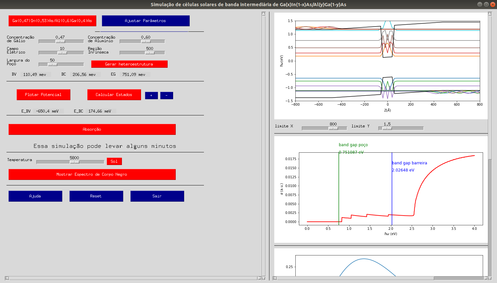
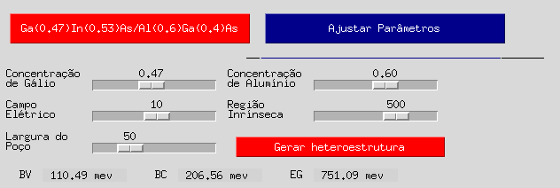

# *Intermediate Band Solar Cell Graphical user interface*

This is a Python implementation of an GUI wrapper for the Fourier Grid Hamiltonian method employied in the analysis of Quantum Well-based Intermediated 
band solar cell.

|  |
|:--:|
| __Fig.1 - GUI__ |


<b>Figure 1</b> shows the main interface. The IBSC is simulated from a p-i-n semiconductor juntion, where a semiconductor with lesser band gap (forming the QW layer) is sandwiched between two layers of a bigger gap semiconductor (forming the barriers). At the present moment, the barriers are formed by , and the QW is formed by . 

The Quantum Well is within the intrisec (non-dopped) region of the p-i-n junction. The n- and p-type dopping generates an intrinsec electric field that bends
the i-layer. When light is shed on the structure, electrons from the valence band (VB) are excited towards the conduction band (CB), unbalancing the charge in the
structure. Connecting the contacts, a short-circuit current is created with both the electrons being drifted at CB and the holes drifted at VB.

Tho control the current generation, several structural parameters can be set:

```
* Quantum Well Width
* Quantum Well height
* Intrinsec electric field
* p-i-n intrisic layer width
```

The GUI allows for controlling such parameters or using standar ones by just clicing the buttons, as shown in __fig. 2__.

|  |
|:--:|
| __Fig.2 - Choosing parameters__ |


The concentration of each element defines the energy bandgap. The misalignment between the different layers put together determines the potential profile of the structure. In the simulation, the concentration of the elements for the barrier layer and the quantum well layer can be adjusted. Therefore, the band offset (related to the difference between the layer's gap distributed across valence and conduction bands) can be adjusted determining the quantum-well heights.

The interface also allows for adjusting the quantum well width, as well as the size of the intrinsic region of the p-i-n junction, and the built-in electric field. After choosing the parameters, the potential profile could be plotted. The interface will display the band offsets and the quantum well bandgap at the right-hand-side panel.

